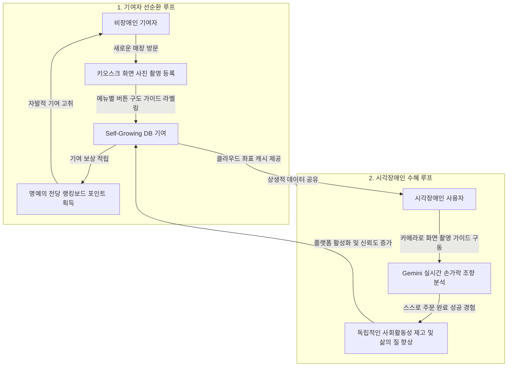
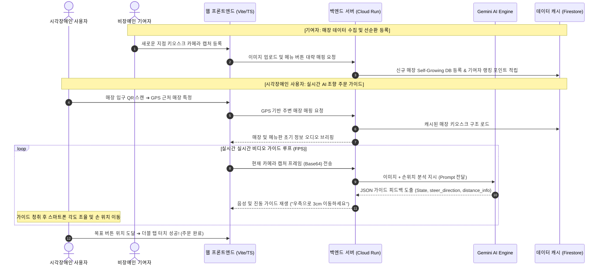

# 🚀 Echo-Menu 3.0: Zero-Software Kiosk Audio-Steering Guide

> **시각장애인을 위한 무설치형 무인 키오스크 실시간 오디오/햅틱 조향 가이드 및 자가성장형 크라우드 소싱 생태계**

### 🔗 실시간 라이브 데모 배포 주소
**[https://echo-menu-app-3f67e6oi2a-du.a.run.app](https://echo-menu-app-3f67e6oi2a-du.a.run.app)**

---

## 💡 프로젝트 기획 배경 및 문제 정의

### 1. 무인화 그늘 속의 새로운 장벽
카페나 식당의 터치스크린 무인 키오스크는 우리 사회에 빠르고 편리한 주문 환경을 선사했지만, 앞을 볼 수 없거나 화면 조작에 미숙한 시각장애인 및 고령층 등 디지털 소외계층에게는 일상적인 음료 주문조차 가로막는 새로운 물리적 장벽이 되었습니다.

### 2. 무설치(Zero-Software) 지향과 따뜻한 시도
기존의 배리어프리 앱들은 스마트폰에 큰 용량의 소프트웨어를 강제로 다운로드하고 가입해야 하는 복잡한 진입 장벽이 존재했습니다. 'Echo-Menu 3.0'은 별도의 설치 과정 없이 매장의 QR 코드 스캔만으로 웹 브라우저가 즉시 비전 AI와 맞물리는 **가볍고(Zero-Software) 친근한 배리어프리 가능성**을 실험하고 탐색합니다.

---

## 🛠️ 핵심 기획 및 선순환 생태계 구조

전국의 모든 키오스크 화면 구도와 신메뉴 좌표 데이터를 소수의 개발팀이나 공공기관이 일일이 수집하고 갱신하는 것은 불가능에 가깝습니다. 저희는 이 한계를 극복하기 위해 **기술과 사람, 그리고 이웃이 서로를 이끄는 선순환 공동체 데이터 생태계**를 기획했습니다.



### 1. 자가성장 데이터베이스 (Self-Growing DB)
비장애인 기여자가 신규 매장의 키오스크 화면을 사진으로 간단히 찍어 등록하면, 시스템 내부적으로 미리 구축된 업종별 템플릿 정보(`public/preset_kiosk_data.json`)와 대조하여 좌표 구조를 생성하고 로컬 및 클라우드 데이터 캐시에 보관합니다. 플랫폼 스스로 정보를 모으고 정교화해 나가는 생태계를 구성합니다.

### 2. 선한 게이미피케이션 (Leaderboard)
기여를 마친 사용자들에게는 기여 빈도와 정확성에 따라 포인트를 부여하고 **"명예의 전당(Leaderboard)"**에 기여자 이름을 올림으로써 자발적이고 재미있는 소셜 기여 모델을 고취합니다.

---

## 🏗️ 시스템 인프라 아키텍처

Echo-Menu 3.0은 구글 클라우드(GCP)의 고성능 서버리스 기술 및 제미나이 멀티모달 비전 AI 모델을 결합하여 밀리초(ms) 단위의 반응 속도를 확보할 수 있도록 설계되었습니다.

```mermaid
graph TD
    User([시각장애인 사용자 / 기여자]) -->|1. 모바일 마이크 / 카메라 촬영 API| CloudRun[Google Cloud Run <br> asia-northeast3]
    
    subgraph Google Cloud Platform (Seoul Region)
        CloudRun -->|클라이언트 에셋 서빙| Frontend[React / Vite + TS Frontend]
        CloudRun -->|수행 지표 및 처리 로그 적재| BigQuery[(Google BigQuery)]
        CloudRun -.->|실제 연동용 NoSQL| Firestore[(Cloud Firestore)]
        CloudRun -->|개발 및 빠른 로컬 캐시 데모| LocalDB[(db_cache.json)]
    end

    subgraph External_AI_Engine
        CloudRun -->|손끝 추적 & 메뉴 실시간 조향 지시| Gemini[Gemini API <br> gemini-2.5-flash]
    end
```

---

## 🔄 사용자 여정 및 분석 워크플로우

시각장애인 사용자와 기여자의 행동 흐름은 다음과 같은 실시간 비디오 프레임 조향 루프를 통해 유기적으로 통합됩니다.



---

## 🚀 로컬 개발 및 실행 환경 가이드

본 프로젝트는 손쉽게 로컬에서 시연 및 성능을 검증할 수 있도록 구성되어 있습니다.

### 1. 환경 설정 파일 구성
루트 경로에 `.env` 파일을 복사하여 Gemini API Key 및 서버 환경을 세팅합니다.
```bash
cp .env.example .env
# .env 파일을 열고 GEMINI_API_KEY 항목에 실제 인증 키를 입력합니다.
```

### 2. 패키지 설치 및 실행
```bash
# 1. 의존성 패키지 설치
npm install

# 2. 클라이언트 빌드 및 정적 에셋 컴파일
npm run build

# 3. 로컬 Express 백엔드 서버 실행
npm start
```
서버 가동이 성공적으로 완료되면 웹 브라우저를 열고 `http://localhost:3000`에 접속하여 Echo-Menu 3.0 가이드 테스트 버전을 직접 조작할 수 있습니다.
