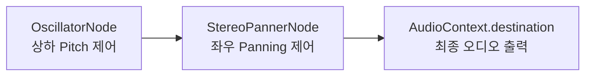

# Frontend System Architecture (fe.md)

본 문서는 Echo-Menu 3.0의 웹 표준 접근성 및 초고속 감각 피드백 연산을 전개하는 프론트엔드 클라이언트 단([app.ts](file:///Users/seungrokyoon/Documents/00_Dev_Master/2026-google-studyjam-hakerthon/public/app.ts))의 세부 기술 아키텍처 명세서입니다.

---

## 🎧 1. HTML5 Web Audio 입체 조향 및 Pitch 변조 파이프라인
* iOS 및 Android 기기의 오토 플레이 제한(Autoplay block)을 우회하기 위해, 사용자 최초의 터치 이벤트 콜백 내부에서 `AudioContext`를 이니셜라이징하고 `resume()` 시킵니다.
* 오디오 신호 흐름은 **[OscillatorNode] ➔ [StereoPannerNode] ➔ [AudioContext.destination]** 순으로 믹싱됩니다.

### 🎛️ 노드별 변조 규칙
1. **상하 조향 피치 변조 (OscillatorNode):**
   * 위로 유도할 때 (Up): `frequency.setValueAtTime(800, audioCtx.currentTime)` ➔ 맑은 고음 출력.
   * 아래로 유도할 때 (Down): `frequency.setValueAtTime(250, audioCtx.currentTime)` ➔ 낮은 저음 출력.
2. **좌우 조향 패닝 변조 (StereoPannerNode):**
   * 오른쪽 유도 (Right): `pan.value = 1.0` ➔ 소리가 완전 우측 이어폰 채널로 쏠림.
   * 왼쪽 유도 (Left): `pan.value = -1.0` ➔ 소리가 완전 좌측 이어폰 채널로 쏠림.
3. **타겟 락인 벨소리 (Locked Sound):**
   * 조준 완료(5px 범위 안착) 시, `440Hz ~ 1000Hz` 사이의 청아한 주파수 복합 멜로디 파형을 결합 출력하여 락인을 물리 청각화합니다.

---

## 📱 2. Zero-UI 멀티터치 제스처 판단 엔진
`touchstart` 및 `touchmove` 모바일 접촉 이벤트를 감지하여 접촉 손가락의 개수(`e.touches.length`)를 바탕으로 동적으로 분기합니다.

* **5지/주먹 감지 (`length >= 5`):** `stopAudioSteering()` 및 `isFreezed = true` 를 걸어 비디오 캡처 루프와 음향을 중지하여 대기 모드를 개시합니다.
* **3지 감지 (`length === 3`):** 2초 디바운스를 거쳐 `currentKioskState`를 이전 단계로 롤백하고 `renderKioskScreen()`을 강제 호출하여 웹 백 네비게이션을 전개합니다.
* **2지 감지 (`length === 2`):** 조향 비프음을 차단하여 낭독 방해를 막고, 두 손가락 중심 좌표 아래 겹쳐진 메뉴의 이름과 가격을 1.5초 주기로 스캔해 TTS 브리핑합니다.
* **1지 감지 (`length === 1`):** `startAudioSteering()`을 켜서 조향 안내음을 개시하고, 한 손가락 궤적 트래킹을 받아 실시간 조향 오프셋을 수학 연산합니다. 락인 안착 완료 1초 유지 시 자동 탭 주문 처리를 이행합니다.

---

## 🎥 3. 4초 주기 비디오 프레임 전처리 및 송신
* 브라우저 웹캠 비디오 스트림을 4초 간격으로 Canvas에 드로잉해 `/api/analyze-frame`으로 전송합니다. 분석 안내가 음성 재생 속도를 앞지르지 않도록 기존 1초 주기보다 빈도를 낮췄습니다.
* 이전 프레임 분석 요청이 완료되지 않은 동안에는 다음 주기 요청을 건너뛰어 응답 순서 역전과 중복 상태 전이를 방지합니다.
* 네트워크 전송 오버헤드와 Gemini 비전 로드를 줄이기 위해 현재 카메라 해상도를 유지한 채 `canvas.toDataURL("image/jpeg", 0.72)`로 JPEG Base64 문자열을 생성합니다.

## 🖼️ 4. 기여자 메뉴판 다중 이미지 업로드
* 기여자는 한 번의 등록에서 JPG, PNG, WebP 메뉴판 사진을 1장부터 최대 10장까지 선택할 수 있습니다.
* 브라우저에서 사진당 4MB, 전체 20MB 제한과 MIME 형식을 먼저 검증하고 선택 장수를 `aria-live` 상태 메시지와 함께 안내합니다.
* 검증된 이미지는 Data URL 배열로 `/api/contribute`에 전송하며 업로드 중 중복 제출을 막기 위해 제출 버튼을 잠급니다.

---

## 🗺️ 5. Google Maps Platform SDK 연동
* **Geolocation API:** `navigator.geolocation.getCurrentPosition`을 호출해 위경도를 즉석 수집하고 반경 50m 이내 매장 템플릿을 드롭다운에 노출합니다.
* **Autocomplete API:** 주소 자동완성 입력 양식에 리스너를 결합해, 자동완성 항목 선택 즉시 마커 핀을 렌더링(`renderMiniGoogleMap`)하고 정확한 **Google Place ID**를 취득합니다.

---

## 📦 6. 빌드 도구 및 패키지 매니저 (Build & Package Management)
* **패키지 매니저 (pnpm):** 프로젝트 전반의 의존성 관리 도구로 **`pnpm` (Performant npm)**을 채택합니다. 중복 의존성을 하드 링크하여 디스크 공간을 비약적으로 절감하고, 초고속 캐싱 알고리즘을 통해 해커톤 CI/CD 파이프라인 컴파일 빌드 속도를 극한으로 가속합니다.
* **프론트엔드 번들러 (Vite v5):** 최신 ESM(ES Modules) 기반의 **`Vite` 번들러**를 적용해 100ms대의 초고속 실시간 HMR(Hot Module Replacement)을 활성화하고 프로덕션 고압축 번들 트리를 가동합니다.
