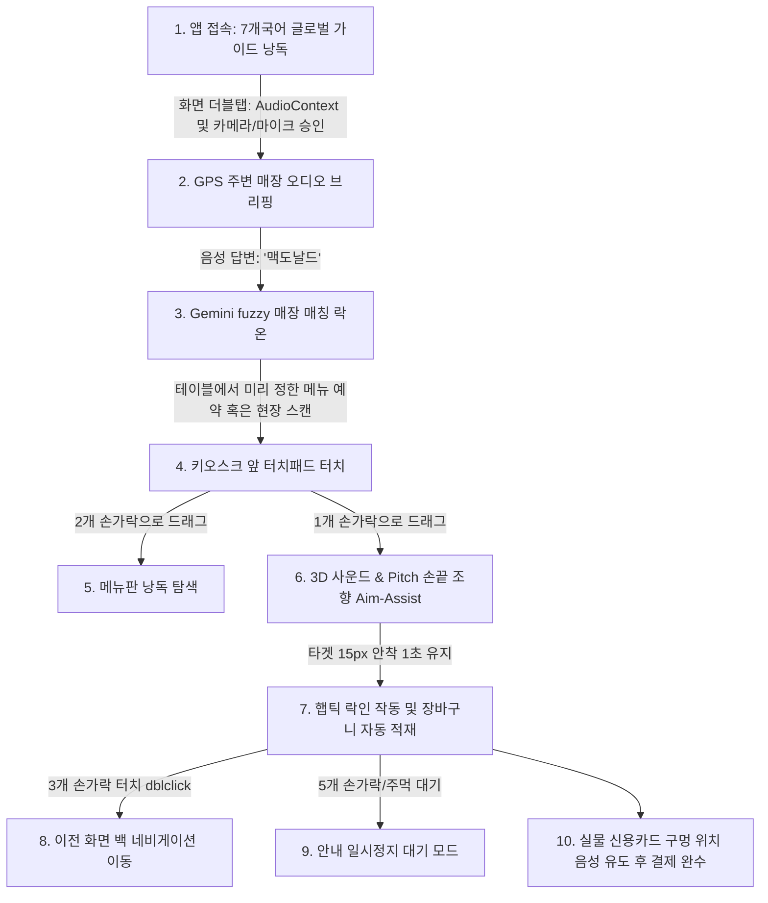
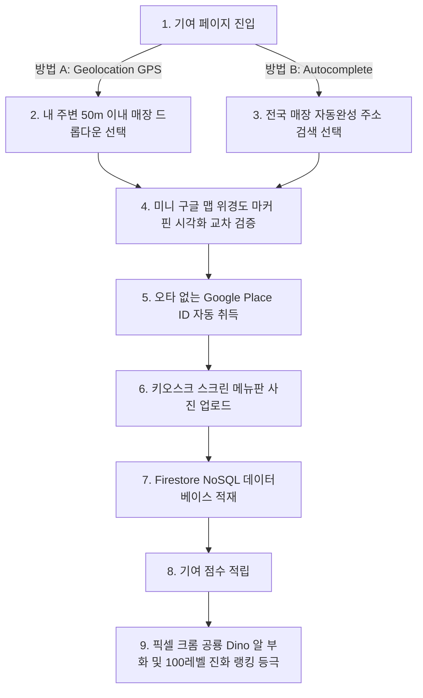

# Echo-Menu 3.0: 배리어프리 히어로즈 (Project Introduction)

본 문서는 Google Cloud Study Jam Hackathon 출품작 **Echo-Menu 3.0**의 마스터 소개서이자, 향후 NotebookLM 영어 팟캐스트/오디오 오버뷰 생성 및 README.md 작성을 위한 공인 자료 문서입니다.

---

## 🦖 1. 프로젝트 개요 (Project Summary)
* **프로젝트 제목:** Echo-Menu 3.0 (배리어프리 히어로즈)
* **해커톤 공모 주제:** Track 3 (Social Good) - 구글 클라우드 기술을 이용한 사회적 장벽 극복 및 취약 계층 지원 솔루션

---

## ⚖️ 2. 선택 배경 및 문제의식 (Problem & Background)

1. **배리어프리 키오스크 기기의 비현실적 도입 비용:**
   * 기존 하드웨어 개조식 배리어프리 키오스크는 대당 500만 원에서 1,000만 원의 높은 설치 비용이 소요됩니다. 이로 인해 전국 소상공인 식당 도입률은 5% 미만에 머물고 있어 시각장애인이 접근 가능한 오프라인 매장이 극히 제한됩니다.
2. **단순 OCR 비전 리더의 물리 조준 한계:**
   * 기존 시각장애인 보조 앱(구글 렌즈 등)은 화면 속 글자를 TTS로 크게 읽어줄 뿐, **"실물 모니터 액정 스크린의 상하좌우 어느 2D 위치에 손가락을 뻗어 터치해야 하는가?"**에 대한 물리적 조향 인도를 전혀 하지 못합니다.
3. **대기열에서 겪는 극심한 심리적 불안감:**
   * 키오스크 앞에서 메뉴 판독을 위해 오랜 시간 지체하면 뒤에 대기하는 비장애인들의 따가운 시선과 한숨이 유발됩니다. 이는 시각장애인들이 결국 주문 자체를 포기하게 만드는 큰 심리적 장벽이 됩니다.

---

## 🎯 3. 도메인별 핵심 기능 (Core Features)

### 3-1. 시각장애인 조향 어시스트 도메인 (Assistance Domain)
* **대화형 지능 매장 특정 온보딩:** 앱 개시 즉시 GPS로 주변 100m 매장을 음성 브리핑하고, 사용자의 모호한 답변("맥날", "스벅")을 Gemini AI가 주변 주소와 대조해 의미론적으로 락온합니다.
* **로컬 조준 Aim-Assist 캐싱 (60FPS):** 백엔드 Gemini 분석기가 1회 추출한 타겟 버튼 좌표 정보를 프론트엔드 로컬 단에 캐싱하여, 네트워크 레이턴시 없이 사용자의 실시간 손끝 좌표와 타겟 간 편차를 60FPS 속도로 0ms 지연 연산합니다.
* **3D 입체 음향 & Pitch 방향 조향 (iOS Fallback):** iOS 사파리가 물리 진동을 차단하는 보안 한계를 웹 표준 `Web Audio API`를 통해 극복합니다. (우측: 소리 오른쪽 쏠림, 좌측: 소리 왼쪽 쏠림, 상단: 800Hz 고음 비프, 하단: 250Hz 저음 비프).
* **Zero-UI 멀티터치 제스처 판단 엔진:**
  - **1지 터치:** 조향음 가동 및 60FPS 손끝 추적 ➔ 타겟 15px 안착 1초 대기 시 장바구니 자동 적재 완료.
  - **2지 터치:** 조향음을 끄고 드래그 중인 손가락 아래의 메뉴명/가격을 실시간 1.5초 주기로 TTS 음성 낭독.
  - **3지 터치:** 이전 화면으로 백 네비게이션 복귀 (엄지, 검지, 중지의 인체공학적 3점 물리 안정 제스처).
  - **5지/주먹 터치:** 조향음 및 비디오 전송 일시 정지(Pause) ➔ 대기 모드 가동.

### 3-2. 기여자 게이미피케이션 및 데이터 생태계 (Contributor Domain)
* **구글 맵 Autocomplete 기반 전국 기여:** 기여자가 GPS 내 주변 50m 매장을 원클릭으로 선택하거나, Autocomplete 장소 자동완성 검색창을 통해 전국 어느 매장이든 주소 정합성이 보장된 Google Place ID로 1초 만에 메뉴 사진을 업로드해 공헌합니다.
* **Dino 100단계 부화-진화 리더보드:** 기여 점수에 따라 크롬 공룡 캐릭터가 알에서부터 히어로 공룡까지 100단계로 진화하고 명예의 전당 랭킹에 카드 형태로 시각화됩니다.

---

## 🏗️ 4. Google Cloud 인프라 선정 사유 (Infrastructure Justification)
* **Gemini 3.5 Flash:** 초고속 추론(TTFT 0.5초 이내)을 통해 실시간 손끝 트래킹 보정을 완성하고, Pro 모델 대비 90% 저렴한 비용으로 무제한 데모 트래픽 예산을 세이빙합니다.
* **Cloud Firestore:** 매장마다 판이한 메뉴 옵션의 유기적 JSON 도큐먼트 구조를 스키마 DDL 마이그레이션 없이 다이렉트 수용하는 최적의 NoSQL Native DB입니다.
* **Cloud Armor WAF L7 Rate Limiter:** IP당 1분당 최대 60회 초과 요청 매크로를 선단 에지 단에서 즉시 WAF 차단하여 Cloud Run 컨테이너의 요금 폭탄을 100% 미연 방지합니다.
* **BigQuery & Looker Studio:** 이용 통계 및 공헌 랭킹 데이터를 실시간 스트리밍 인서트하여 लुक러 스튜디오 iframe 차트로 실시간 시각화 웹 임베딩을 완수합니다.

---

## 🗺️ 5. 유저별 상세 시나리오 (User Flows)

### 5-1. 시각장애인 시나리오 (Order Journey)

### 5-2. 일반 기여자 시나리오 (Contribution Journey)

---

## 🏁 6. 프로젝트 발전 제언 및 한계점 (Future Work & Limitations)

1. **주문 전체 라이프사이클 중 도착 시점 이후에만 국한된 한계:**
   * 본 서비스는 시각장애인이 음식점에 안전하게 도달한 시점(매장 안 키오스크 앞) 이후의 메뉴판 탐색과 실제 결제 물리 유도에 국한되어 있습니다. 향후 지도 내비게이션(Google Maps API) 및 실외 도보 인도 에이전트 서비스와 결합하여 매장 방문 이전 동선까지 End-to-End로 확장해야 합니다.
2. **실물 기기 및 물리적 키오스크 하드웨어 테스트 검증 누락:**
   * 해커톤 현장 개발 제약으로 인해 실제 매장에 설치된 수십 개의 제조사별 실물 카드 리더기 슬롯과 터치스크린 액정 위에서 대규모 물리적 필드 테스트를 진행하지 못했습니다. 추후 다양한 형태의 키오스크(삼성, LTA 등) 실물 장비를 임차하여 손가락 Bounding Box 정합성과 영수증 배출구 음향 가이드의 현장 정밀도를 전격 보정해야 합니다.
3. **카메라 앵글의 물리적 파지 피로도:**
   * 스마트폰을 가슴 높이에 고착시키는 Chest-Hold 파지법을 제안하나, 장시간 주문 지연 시 손목 및 상체 근육 피로를 유발할 수 있습니다. 안경형 스마트 웨어러블 디바이스(스마트 글래스) 또는 넥 밴드형 카메라 인터페이스로 진화하여 Hands-free 배리어프리로 발전시킬 것을 제언합니다.

---

## 🤖 7. AI Harness & Agentic Engineering (AI 협업 및 개발 도구)

본 프로젝트는 단순 텍스트 자동완성이 아닌, 구글의 첨단 에이전트 인프라인 **Antigravity(AGY) SDK** 및 **Gemini CLI/IDE** 프레임워크를 개발 라이프사이클 전반에 걸쳐 하네스(Harness)로 묶어 활용한 **AI 에이전트 협동 개발(Agentic Co-development)** 산출물입니다.

### 7-1. 사용된 AI 엔지니어링 도구 스택
1. **Google Antigravity (AGY) SDK & Agent Engine:**
   * 페어 프로그래밍(Pair Programming) 파트너이자 소스코드 수정, 예외 처리, 디렉토리 배치를 자동화하는 주체적 에이전트 인프라로 구동.
2. **Antigravity IDE & Gemini CLI (`agy`):**
   * 터미널 CLI 컴파일 명령 및 파일 입출력을 샌드박스 환경 내부에서 자율 실행하고 리포트하는 백그라운드 태스크 엔진으로 사용.

### 7-2. 하네스(Harness) 구성 및 슬래시 커맨드 활용
* **Planning Mode Workflow (이단 가용 프로토콜):**
  * 코드 수정 전 `docs/implementation_plan.md`를 빌드하여 유저에게 검토 및 승인 피드백(RequestFeedback: true)을 먼저 받아 안전망을 확보한 뒤, `docs/task.md` checklists를 마크업해 나가는 자율 협업 구조 준수.
* **`/grill-me` (대화식 디베이트 인터뷰):**
  * 스키마 제약이 있는 RDBMS(AlloyDB) 배제 사유, iOS Safari 물리 진동 차단 한계 극복을 위한 주파수 피치 매핑, 3점 및 5점 터치 제스처 인체공학적 타당성 등 아키텍처 핵심 결정의 검증을 위해 **AI 1:1 디베이트 인터뷰**를 기동해 설계를 견고하게 락인.
* **`/goal` (장기 고도화 자율 에이전트):**
  * 다국어 온보딩, 이중 차단 락, 대화형 매칭 API 연동 등 대형 코드 수정 작업을 중단 없이 목표 완수할 수 있도록 `/goal` 태스크 관리 적용.

### 7-3. 활용한 에이전트 스킬 (Agent Skills)
* **`modern-web-guidance`:** 최신 웹 표준 스펙을 리서치해 Web Audio API `StereoPannerNode` 및 Vibration API의 브라우저별 정책 변화를 즉시 반영.
* **`a11y-debugging` (배리어프리 검사):** 전맹 사용자의 접근성 함정(Accessibility Trap)을 격리하기 위해 탭 타겟 크기, 고대비 스타일링 및 스크린 리더 낭독 흐름 무결성 검증.
* **`chrome-devtools`:** 브라우저 모바일 시뮬레이터와 내부 오디오Context의 가동 상태를 분석해 오토플레이 차단 극복 절차 이식.

### 7-4. 구글 인공지능 모델 믹스 전략 (Multi-Model Tier Strategy)
본 프로젝트는 **Nano (온디바이스/오프라인) ➔ Flash/Bannano (실시간 조향/OCR) ➔ Pro (원형 에셋 생성)**로 이어지는 구글의 인공지능 멀티 모델 레이어링을 유기적으로 배치해 비용 효율성과 성능의 극값을 달성했습니다.
1. **Gemini 2.5/2.0 Flash (nickname: Bannano):** 실시간 비디오 프레임 메뉴판 OCR 스캔 및 100단계 Dino 진화 상태에 따른 명예의 전당 카드 시구 생성. TTFT 0.5초 이내의 실시간 속도와 Pro 대비 1/10 수준의 비용 최적화 달성.
2. **Imagen 3 Pro & Gemini 1.5 Pro:** 일그러짐 없는 고대비 레트로 8-bit 크롬 공룡 캐릭터 100단계 진화형의 마스터 디자인 스프라이트 에셋 대량 생성. 탁월한 프롬프트 충실도 보장.
3. **Gemini Nano:** 지하철 등 난청/통신 저하 지역에서 기여자 촬영 사진의 OCR 타당성(화면 정합성)을 클라우드 호출 없이 브라우저 내에서 즉각 1차 스크리닝하여 불필요한 트래픽 차단.

---

## 🛠️ 8. 핵심 기술 스택 요약 (Core Technology Stack)

본 프로젝트는 고성능 모바일 사용성과 경량화된 서버리스 배포 속도를 위해 아래의 검증된 기술 스택으로 무장했습니다.
* **패키지 매니저 (Package Manager):** **`pnpm` (v9)** — 하드 링크 기반의 중복 의존성 제로화, 초고속 캐싱 및 컨테이너 빌드 가속 보장.
* **프론트엔드 (Frontend):** **TypeScript + Vite (v5)** — ESM 기반 HMR 및 모바일 웹 가상 터치패드 레이아웃.
* **백엔드 (Backend):** **Node.js LTS (v22) + Express.js** — 초경량 이벤트 루프 기반 실시간 프레임 분석 브릿지 API.
* **클라우드 인프라 (GCP Serverless):**
  - **Google Cloud Run** (서버리스 오토스케일 컨테이너)
  - **Cloud Firestore** (자가 성장 NoSQL 데이터베이스)
  - **Google BigQuery** (실시간 분석 및 스트리밍 로그 적재)
  - **Memorystore Redis** (컨테이너 분산 Rate Limiting 동기화)

